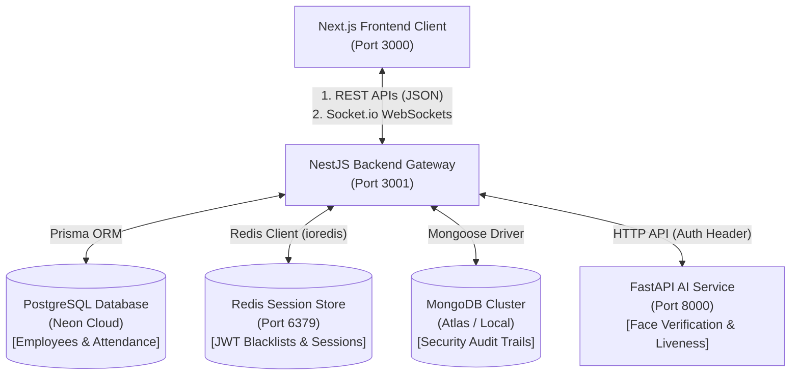

# ZeroProxy

> **Enterprise-Grade Smart Face Authentication & Employee Real-time Monitoring Gateway**

ZeroProxy is an advanced workplace attendance and session monitoring system. It features **biometric face recognition** with **anti-spoofing liveness detection**, **multi-device session tracking** (with remote termination capabilities), **real-time WebSocket notifications**, and **MongoDB-backed transactional audit logging**.

---

## 🏛️ System Architecture & Data Flow

ZeroProxy relies on a modern distributed architecture. The flow of requests and communication follows a strict pattern to ensure high security, low latency, and audit trail reliability:



### Communication Flow:
1. **User Authentication**: Client posts credentials to the NestJS Gateway. NestJS issues two JWT tokens: an **Access Token** (stored in cookies, short-lived) and a **Refresh Token** (stored in cookies, long-lived).
2. **WebSocket Handshake**: On dashboard load, the client opens a WebSocket connection to `http://localhost:3001/events` (namespace `/events`) using the Access Token for authentication.
3. **Face Verification Check-in**:
   * Employee accesses `/employee/dashboard`, opens the camera component, and takes capture frames.
   * Captured frames are sent to the NestJS Backend.
   * The NestJS Backend forwards the frames with the secret API Key to the FastAPI AI service.
   * FastAPI uses computer vision libraries to verify if a face matches the user's registered face embedding and performs liveness computations to ensure it's not a printout/screen display.
   * If validated, NestJS writes a `CHECKED_IN` record to PostgreSQL, posts a security log to MongoDB, and broadcasts an `employee:checkin` event to the `admin:${companyId}` socket room.

---

## 🛠️ Technology Stack Breakdown

Here is a detailed breakdown of why each technology is chosen and how it is implemented:

### 1. Frontend: Next.js 16, TailwindCSS & Zustand
* **Next.js 16 (App Router)**: Leverages React Server Components (RSC) and strict layout routing to isolate client-side sub-dashboards (Employee vs. Admin) and route protection middleware.
* **Zustand**: A lightweight, boilerplate-free state manager used for storing authentication states (`user`, `isAuthenticated`) persistable in browser storage.
* **Socket.io Client**: Manages real-time connection lines, listens to gateway events, and dynamically updates dashboard listings without page refreshes.
* **Axios + HTTP Interceptors**: Intercepts outgoing requests to attach JWT headers. Handles token refreshes seamlessly on receiving `401 Unauthorized` responses by hitting `/auth/refresh` using the Refresh Token.

### 2. Backend Gateway: NestJS (TypeScript)
* **NestJS**: A modular Node.js framework providing clean separation of concerns via modules, controllers, and services. Uses dependency injection to decouple database clients (Prisma, Redis, Mongo) from controller endpoints.
* **Prisma ORM**: A modern database toolkit. PostgreSQL handles structured transactional schema elements (Users, Companies, Attendance logs) where ACID compliance is critical.
* **Socket.io (NestJS WebSockets)**: Enables bidirectional communication channels. Utilizes **Room Isolation** to restrict target payloads:
  * `company:${companyId}`: Room joined by all employees of a company.
  * `admin:${companyId}`: Restricted room joined only by `ADMIN` and `HR` users.
* **Passport JWT**: Integrates access token validation and role-based guards (`@UseGuards(RolesGuard)`).

### 3. Session Caching & Token Blacklisting: Redis
* **Active Session Management**: Active user sessions are tracked in Redis. If a user logs in from a new device, a session log is updated. Admins can check live session listings and remotely terminate sessions.
* **Token Blacklisting**: On logout, access tokens are added to a Redis blocklist with a TTL (Time-To-Live) equal to the remaining duration of the token, preventing token reuse.

### 4. Non-Blocking Audit Trails: MongoDB & Mongoose
* **MongoDB**: NoSQL database chosen for its high-performance document ingestion. 
* **Audit Logs**: Every login, failed login attempt, check-in, check-out, and administrative modification creates an immutable log record. Using MongoDB prevents high-volume logging from clogging Postgres transactional tables.

### 5. Computer Vision & Liveness: FastAPI, OpenCV & PyTorch
* **FastAPI**: Extremely fast, asynchronous Python API framework with automatic OpenAPI docs generation.
* **OpenCV / Face Recognition**: Extracts face landmarks and embeds them into vector signatures, comparing them with registered employee profiles.
* **Liveness Detection**: Processes multi-frame arrays to calculate changes in facial depth, blink rates, and micro-movements, validating that a live user is present.

---

## 📂 Detailed Folder Structure & Key Files

```
ZeroProxy/
├── backend/                  # NestJS API Engine
│   ├── prisma/
│   │   ├── schema.prisma     # SQL schemas (Company, User, Attendance, Sessions)
│   │   └── seed.ts           # Populates admin@test.com & emp@test.com accounts
│   ├── src/
│   │   ├── activity/        # MongoDB audit logging logic
│   │   ├── attendance/      # Check-in, Check-out, and reports endpoint
│   │   ├── auth/            # JWT guards, login/logout logic, token refresh
│   │   ├── common/          # Global interceptors, filter exception handlers
│   │   ├── events/          # WebSocket gateways & room router
│   │   ├── redis/           # Redis module for blacklist caches & active session stores
│   │   ├── sessions/        # Device session tracking & remote logout hooks
│   │   └── users/           # Employee profiles, stats, and registration
│   ├── test/                 # E2E integration test suite
│   └── test_websockets.js   # Programmatic WebSocket testing script
│
├── frontend/                 # Next.js 16 Web Portal
│   ├── src/
│   │   ├── app/
│   │   │   ├── (auth)/login  # Login screen
│   │   │   ├── admin/       # Layout guard, live activity, admin dashboard page
│   │   │   └── employee/    # Layout guard, camera scanner, checkin logs page
│   │   ├── components/
│   │   │   ├── admin/       # Sidebar navigation, stats cards, live logs component
│   │   │   ├── employee/    # Sidebar navigation, camera capture controls
│   │   │   └── ui/          # Generic design system components (buttons, input, modal, badge)
│   │   ├── hooks/           # useAuth and useSocket react hook handlers
│   │   ├── lib/             # Axios API client, configuration files, formatting helpers
│   │   ├── store/           # Zustand store for authentication state persistence
│   │   └── types/           # Core TypeScript interface definitions
│
└── server/                   # Python FastAPI AI Service
    ├── app/
    │   ├── main.py          # FastAPI application configuration & health
    │   ├── config.py        # Environment validation & loading
    │   ├── database.py      # Local sqlite initialization for facial profiles
    │   ├── routers/         # Liveness endpoints (/liveness/check, /liveness/check/single)
    │   └── services/        # Face embedding validation and anti-spoofing computations
    └── tests/                # Local face image fixtures & unit tests
```

---

## ⚙️ Environment Configurations

Each folder must contain its own environment file:

### 1. Backend (`backend/.env`)
```properties
PORT=3001
NODE_ENV=development
DATABASE_URL="postgresql://..." # Neon PostgreSQL Connection string
MONGODB_URI="mongodb+srv://..."  # MongoDB Audit Log connection string
REDIS_URL="redis://localhost:6379"
JWT_SECRET="secret-access-key"
JWT_REFRESH_SECRET="secret-refresh-key"
AI_SERVICE_URL="http://localhost:8000"
INTERNAL_API_KEY="zeroproxy_internal_key" # Shared secret to authenticate NestJS -> FastAPI
```

### 2. Frontend (`frontend/.env.local`)
```properties
NEXT_PUBLIC_API_URL=http://localhost:3001/api # Gateway endpoint
NEXT_PUBLIC_WS_URL=http://localhost:3001     # WebSocket root
NEXT_PUBLIC_APP_NAME=ZeroProxy
NEXT_PUBLIC_APP_VERSION=1.0.0
```

### 3. AI Service (`server/.env`)
```properties
API_KEY="zeroproxy_internal_key" # Shared secret to validate requests from NestJS
MODEL_DIR="app/models"            # Local storage for weights and profiles
```

---

## 🚀 Setup & Launch Sequence

Follow this exact boot sequence to run all services locally:

### Step 1: Docker Containers (Cache & Audit DBs)
Start Redis and MongoDB:
```bash
docker-compose up -d
```

### Step 2: FastAPI AI Service
Install Python packages and start the server:
```bash
cd server
.venv\Scripts\Activate.ps1
pip install -r requirements.txt
uvicorn app.main:app --host 0.0.0.0 --port 8000 --reload
```
*Port: 8000*

### Step 3: NestJS Backend Gateway
Install dependencies, apply database schemas, seed credentials, and launch:
```bash
cd ../backend
npm install
npx prisma db push
npx prisma db seed
npm run start
```
*Port: 3001*

### Step 4: Next.js Frontend
Install packages and start the UI dev compiler:
```bash
cd ../frontend
npm install
npm run dev
```
*Port: 3000*

---

## 🧪 Testing & Verification Scripts

We have automated verification tools to audit each phase of the application:

### 1. Real-time WebSocket Gateway Verification
Simulates admin and employee socket nodes, performing connect, ping-pong, check-in, check-out, and remote kick logic:
```bash
cd backend
node test_websockets.js
```

### 2. MongoDB Logging Flow
Verifies audit trail creation, user activity limits, and security logs in MongoDB:
```powershell
cd backend
powershell -File test_phase6.ps1
```

### 3. Face Biometrics & Liveness Test
Sends image mockups, validates vector verification distances, and tests multi-frame anti-spoofing limits:
```bash
cd server
.venv\Scripts\python run_phase4_tests.py
```
