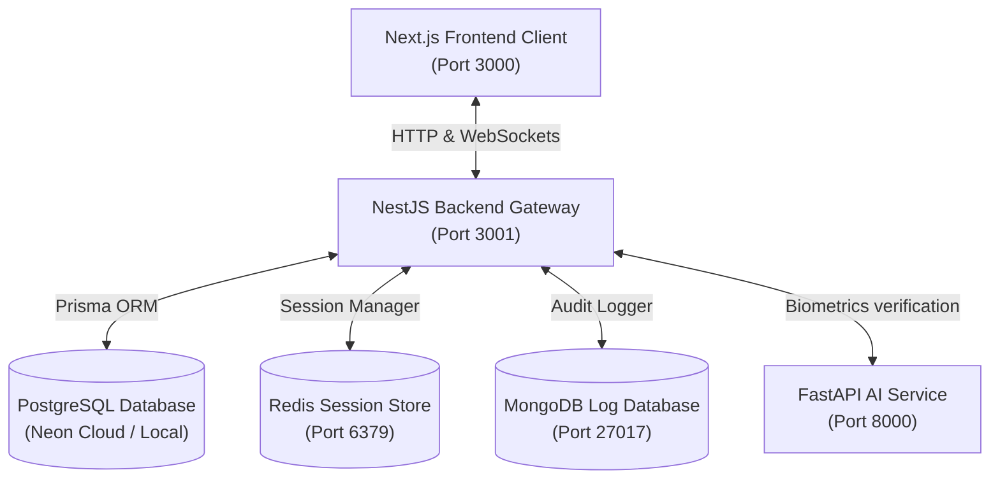

# ZeroProxy

> **Smart Face Auth & Employee Real-time Monitoring Gateway**

ZeroProxy is an enterprise-grade employee attendance tracking and monitoring platform. It combines biometric **Face Authentication** (with liveness detection), **Multi-device Session Control**, **real-time WebSocket event feeds**, and **persistent MongoDB audit logs** to provide a robust, modern workplace presence system.

---

## 🏛️ System Architecture

ZeroProxy is structured as a monorepo containing three core services working in harmony:



---

## 📂 Services Breakdown

* **[`/frontend`](file:///c:/Users/arunk/Desktop/ZeroProxy/frontend)**: Next.js 16 Client SPA using TailwindCSS design systems, Zustand state management, and real-time Socket.io channels. Includes distinct responsive views for **Employees** (check-in camera feed, dashboard, history) and **Admins** (live feeds, employee directory, active sessions).
* **[`/backend`](file:///c:/Users/arunk/Desktop/ZeroProxy/backend)**: NestJS Gateway API driving business logic, authentication guards, real-time Socket.io namespaces (`/events`), Redis token-blacklist cache, and MongoDB/Prisma database connections.
* **[`/server`](file:///c:/Users/arunk/Desktop/ZeroProxy/server)**: Python FastAPI Service powered by OpenCV/PyTorch to execute single-frame facial verification and multi-frame liveness checks.

---

## 🌟 Key Features

1. **Secure Face Auth**: Captures camera frames to verify employee match embeddings while verifying movement and blink parameters to prevent photo-presentation attacks.
2. **Real-time Live Activity Feed**: Admin dashboards receive instant WebSocket streams for check-ins, check-outs, logins, and logouts.
3. **Multi-device Session Control**: Admins can inspect all active connections and remotely terminate sessions (forces immediate client-side socket disconnection and logout).
4. **Audit Logs**: Secure MongoDB tracking logs every successful/failed transaction, status transition, and admin action for auditability.

---

## 🚀 Local Installation & Setup

Follow these steps to spin up the entire suite:

### 1. Database & Cache Services (Docker)
Ensure you have Docker running, then start Redis and MongoDB in the background:
```bash
docker-compose up -d
```
*Note: PostgreSQL is hosted on Neon Cloud by default (configured via the NestJS env).*

### 2. Run Python AI/ML Service
Navigate to `/server`, activate the virtual environment, install dependencies, and boot the Uvicorn server:
```bash
cd server
.venv\Scripts\Activate.ps1
pip install -r requirements.txt
uvicorn app.main:app --host 0.0.0.0 --port 8000 --reload
```
*The FastAPI server will start on http://localhost:8000.*

### 3. Run NestJS Backend Gateway
Navigate to `/backend`, install packages, run the seed script to populate test credentials, and start the development server:
```bash
cd ../backend
npm install
npx prisma db seed
npm run start
```
*The backend API will start on http://localhost:3001/api.*

### 4. Run Next.js Frontend Client
Navigate to `/frontend`, install packages, and boot the Next.js dev compiler:
```bash
cd ../frontend
npm install
npm run dev
```
*The React client will run on http://localhost:3000.*

---

## 🔑 Default Credentials

Use these credentials to log in and inspect both system profiles:

* **Admin Access**:
  * **Email**: `admin@test.com`
  * **Password**: `Admin@123`
* **Employee Access**:
  * **Email**: `emp@test.com`
  * **Password**: `Employee@123`

---

## 🧪 Running Validation Tests

Ensure everything works correctly by triggering our automated test scripts:
```bash
# Programmatic WebSocket Gateway testing
cd backend
node test_websockets.js

# Database audit logs testing
powershell -File test_phase6.ps1

# AI service verification tests
cd ../server
.venv\Scripts\python run_phase4_tests.py
```
